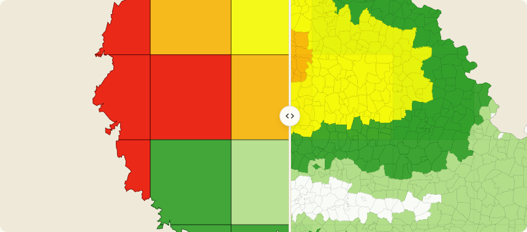
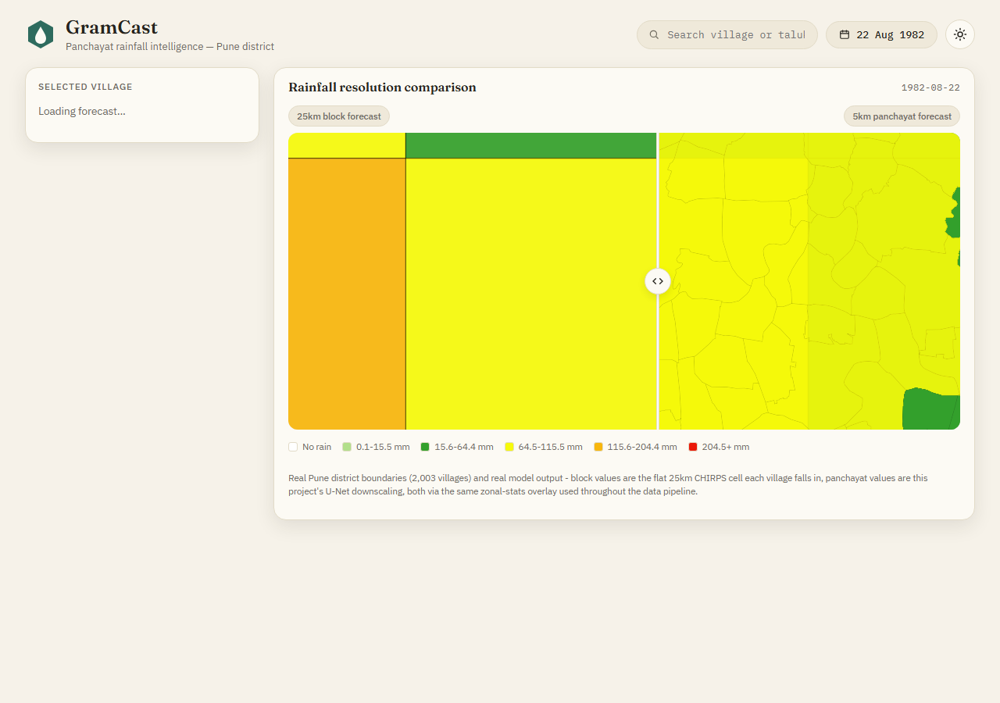
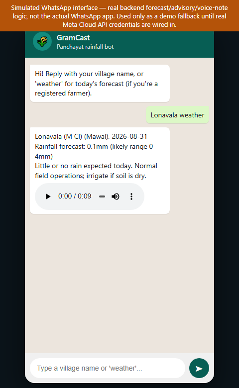

<div align="center">

# GramCast

**Downscaling weather forecasts from block level to panchayat level, for actionable agro-advisories.**

Smart India Hackathon 2026 — Problem Statement **SIH26074** · Team **ModelSomeHow**

[](https://github.com/Akash-design-prog/GramCast/actions/workflows/tests.yml)
[](https://akash-design-prog.github.io/gramcast-docs/)



*Same date, same district — the 25km block grid every farmer currently gets (left) vs. the real
2,003-village mosaic GramCast produces (right).*

</div>

---

Every village in a district is handed the same rainfall number today — one flat value for a ~25km
satellite/IMD grid block. A farmer in a rain-shadow valley and a farmer on a windward ridge, 8km apart
in the same block, get identical advice. GramCast closes that gap: a terrain-aware deep learning model
redistributes the same block-level forecast down to real village (panchayat) boundaries, ships an
honest uncertainty range with every number, and turns the result into a plain-language crop-stage
advisory — delivered over WhatsApp to farmers and a live map dashboard to officials.

## Results at a glance

Every number below is a real measured result, not an estimate — see the linked script for exact
method and sample size.

| Result | Value | Method / sample size |
|---|---|---|
| Ensemble RMSE | **6.97 mm** | 4-trial ensemble, 702 held-out test-day samples (2021–2026), [`ml/ensemble_evaluate.py`](ml/ensemble_evaluate.py) |
| Ensemble correlation | **0.9505** | same 702-sample held-out test set |
| Heavy-rain CSI (≥64.5mm/day) | **0.730** | same 702-sample held-out test set |
| Conformal P10–P90 coverage | **79.46%** (target 80%) | split-conformal, wet-days-only, disjoint by time from train/val, [`ml/conformal.py`](ml/conformal.py) |
| Independent cross-check vs IMD | correlation **0.397** | same ceiling as CHIRPS-vs-IMD's own **0.393** — a real, pre-existing product-disagreement ceiling, not a model weakness |
| Villages covered | **2,003** | Pune district, boundary area within 0.02% of the official district area figure |
| Backend tests | **175 passing** | `pytest backend/tests` — data overlay, inference, advisory rules (+ a 200k-sample fuzz test), TTS, WhatsApp bot, API contract |

Full methodology — including where the model still loses to a baseline, reported honestly rather than
omitted — is in [`validation-results`](https://akash-design-prog.github.io/gramcast-docs/validation-results) on the docs site.

## Repository layout

```
data_pipeline/         downloading, aligning, and building coarse/fine training pairs from raw sources
ml/                    Residual U-Net + mass-conservation layer + quantile heads, training,
                       evaluation, ensembling, split-conformal calibration
backend/               FastAPI service — forecasts, advisory rules, TTS, WhatsApp bot, farmer feedback
frontend/dashboard/    the officials' React + MapLibre dashboard
scripts/               one-off utilities (e.g. building the deployment data bundle)
```

## Quickstart

Clone the repo:

```bash
git clone https://github.com/Akash-design-prog/GramCast.git
```

Install backend dependencies:

```bash
pip install -r requirements.txt
```

Run the backend (from the repo root):

```bash
uvicorn backend.main:app --reload --port 8000
```

Install frontend dependencies (separate terminal):

```bash
cd frontend/dashboard
```

```bash
npm install
```

Run the frontend:

```bash
npm run dev
```

The backend needs the real training-pair arrays and a trained checkpoint present locally (built by
`data_pipeline/` + `ml/train.py`), or `GRAMCAST_DATA_BUNDLE_URL` pointing at a prebuilt data bundle —
see [`scripts/prepare_deploy_bundle.py`](scripts/prepare_deploy_bundle.py).

## See it working

<p align="center">
  
  <br/>
  <em>Click any village: real block vs. panchayat forecast, a calibrated P10–P90 band, and a
  crop-stage advisory — all in one sidebar.</em>
</p>

<p align="center">
  
  <br/>
  <em>The same real backend, reached over WhatsApp — text reply plus a Marathi voice note, no app
  install required.</em>
</p>

## Where to look next

The README stays short on purpose — the full write-up lives on the
[documentation site](https://akash-design-prog.github.io/gramcast-docs/):

- [Getting Started](https://akash-design-prog.github.io/gramcast-docs/getting-started)
- [System Architecture](https://akash-design-prog.github.io/gramcast-docs/architecture)
- [ML Pipeline Internals](https://akash-design-prog.github.io/gramcast-docs/ml-pipeline-internals)
- [Validation & Results](https://akash-design-prog.github.io/gramcast-docs/validation-results)
- [Live Demo Walkthrough](https://akash-design-prog.github.io/gramcast-docs/live-demo-walkthrough)
- [Trust & Uncertainty](https://akash-design-prog.github.io/gramcast-docs/trust-and-uncertainty)
- [Block vs. Panchayat Downscaling](https://akash-design-prog.github.io/gramcast-docs/block-vs-panchayat-downscaling)
- [API Reference](https://akash-design-prog.github.io/gramcast-docs/api-reference)
- [Frontend/Backend Engineering](https://akash-design-prog.github.io/gramcast-docs/frontend-backend-engineering)
- [Test Coverage](https://akash-design-prog.github.io/gramcast-docs/test-coverage)
- [Development Journey](https://akash-design-prog.github.io/gramcast-docs/development-journey)
- [Limitations & Roadmap](https://akash-design-prog.github.io/gramcast-docs/limitations-and-roadmap)

## Tests

```bash
pytest backend/tests -v
```

175 tests: unit, edge-case (blank village names, out-of-range coordinates, nonexistent calendar dates),
a 200k-sample fuzz test on the advisory engine, and full-scale stress tests (100 random dates × 100
random villages). The badge at the top of this page runs this exact command on every push, against the
same real data bundle the deployed backend uses — see
[`.github/workflows/tests.yml`](.github/workflows/tests.yml).

## License and credits

No license file has been added yet — this is an internal Smart India Hackathon prototype.

**Data sources:** [CHIRPS](https://www.chc.ucsb.edu/data/chirps) (Funk et al., 2015), IMD Gridded
Rainfall (Pai et al., 2014), [ERA5-Land](https://cds.climate.copernicus.eu/) (Copernicus/ECMWF),
SRTM DEM (NASA/USGS), [ESA WorldCover](https://esa-worldcover.org/), village boundaries via
[DataMeet](https://datameet.org/).

**Built with:** [PyTorch](https://pytorch.org/), [FastAPI](https://fastapi.tiangolo.com/),
[React](https://react.dev/), [MapLibre GL JS](https://maplibre.org/), [GeoPandas](https://geopandas.org/),
[rasterio](https://rasterio.readthedocs.io/), the [WhatsApp Cloud API](https://developers.facebook.com/docs/whatsapp/cloud-api).
